# Task Management

bu proje bir task management uygulamasinin backend kismini icerir. Teknoloji olarak nestjs ve postgresql kullandim.

bu proje ile firma olusturup firmalar icerisinde projeler olusturabilirsiniz. Projeler icerisinde tasklar olusturabiliriz ve tasklari kullanicilara atayabiliriz.

# Tablolar

- [Users](#users)
- [User Groups](#user-groups)
- [Organizations](#organizations)
- [Organization User](#organization-user)
- [Projects](#projects)
- [Tasks](#tasks)
- [Task User](#task-user)
- [Tags](#tags)
- [Task Tag](#task-tag)
- [Statuses](#statuses)

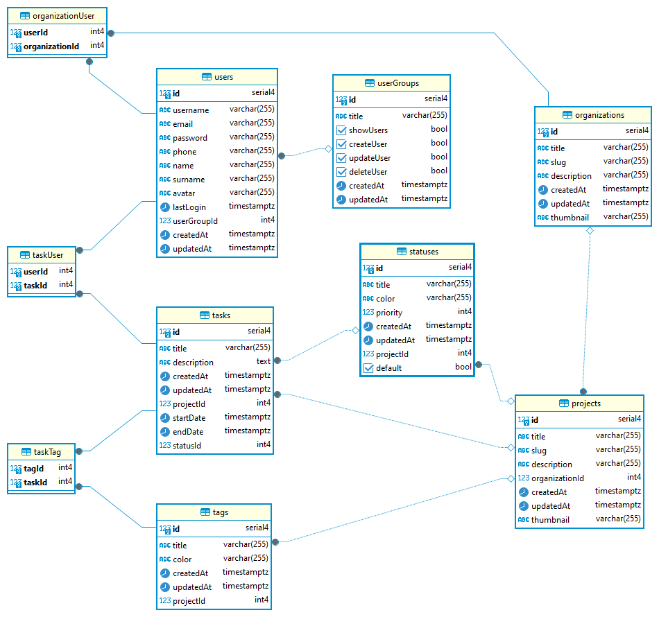

## Users

Bu tablo, tüm kullanıcı bilgilerini içerir.

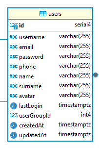

## User Groups

Bu tablo, kullanıcıların yetki seviyelerini ve `CRUD` işlemleri için gerekli özellikleri barındırır. Her kullanıcının bir grubu olacaktır; bu nedenle, `users` tablosu ile `userGroups` tablosu arasında `one-to-one` ilişkisi bulunmaktadır.

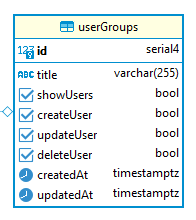

## Organizations

Bu tablo, firmaları içerir. Tablo, firma adı, slug, açıklama (description) ve küçük resim (thumbnail) gibi çeşitli alanları içerir.

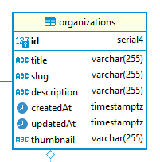

## Organization User

Bu tablo, kullanıcılar ile firmalar arasındaki ilişkiyi yönetir. Bir firmanın birden fazla kullanıcısı olabilir ve bir kullanıcının birden fazla firmaya kayıtlı olabileceğinden, `users` ve `organizations` tablosu arasındaki `many-to-many` ilişkiyi sağlar. İki ana alanı vardır ve foreign key ile ilgili tablolar arasında ilişki kurulmuştur.

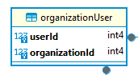

## Projects

Bu tablo, firmaların projelerini içerir. Örneğin, X firmasının A projesi gibi. `organizationId` alanı ile `organizations` tablosu arasında `one-to-many` ilişkisi kurulmuştur.

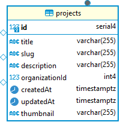

## Tasks

Bu tablo, görevlerin bilgilerini içerir. Her görev için gerekli tüm bilgiler burada tutulur. `projects` ve `statuses` tablosu ile `one-to-many` ilişkisi vardır; bir görev bir projede olabilir ve bir görevin bir status'u vardır.

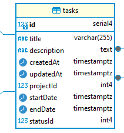

## Task User

Bir kullanıcının birden fazla görevi olabilir ve bir görev birden fazla kişiye atanmış olabilir. Bu nedenle, `many-to-many` ilişkiyi sağlamak için gerekli ara tablo.

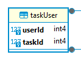

## Tags

Her görevi kategorize etmek için birden fazla etiket tanımlanabilir. Her proje için ayrı etiketler olabilir. Bu nedenle, `projects` tablosu ile `one-to-many` ilişkisi bulunur.

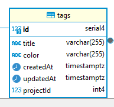

## Task Tag

Bir görevin birden fazla etiketi olabilir ve bir etiket birden fazla görevde kullanılabilir. Bu nedenle, `many-to-many` ilişkiyi sağlamak için gerekli ara tablo.

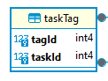

## Statuses

Bu tablo, görevlerin durumlarını içerir. Her görev bir duruma sahip olabilir ve bu nedenle `tasks` tablosu ile `one-to-many` ilişkisi bulunmaktadır.

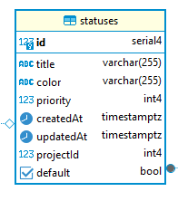
